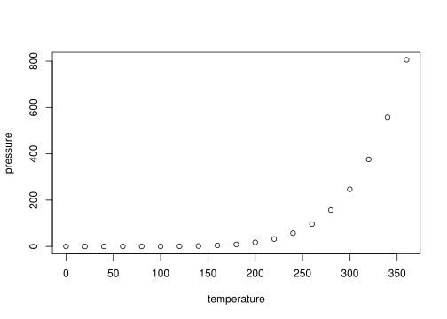
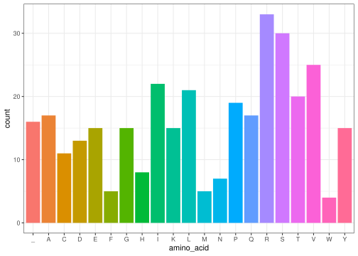

<!-- README.md is generated from README.Rmd. Please edit that file -->

# cendog

<!-- badges: start -->
<!-- badges: end -->

The goal of cendog is to …

## Installation

You can install the development version of cendog from
[GitHub](https://github.com/) with:

``` r
# install.packages("pak")
pak::pak("rforbiodatascience25/group_16_package")
```

## Example

This is a basic example which shows you how to solve a common problem:

``` r
library(cendog)
## basic example code
```

What is special about using `README.Rmd` instead of just `README.md`?
You can include R chunks like so:

``` r
summary(cars)
#>      speed           dist       
#>  Min.   : 4.0   Min.   :  2.00  
#>  1st Qu.:12.0   1st Qu.: 26.00  
#>  Median :15.0   Median : 36.00  
#>  Mean   :15.4   Mean   : 42.98  
#>  3rd Qu.:19.0   3rd Qu.: 56.00  
#>  Max.   :25.0   Max.   :120.00
```

You’ll still need to render `README.Rmd` regularly, to keep `README.md`
up-to-date. `devtools::build_readme()` is handy for this.

You can also embed plots, for example:



In that case, don’t forget to commit and push the resulting figure
files, so they display on GitHub and CRAN.

# CENDOG

WE are replicating the Central Dogma of biology.

``` r
library(cendog)
```

## Generate a Random DNA Sequence

``` r
N <- 1000
DNA_seq <- gen_seq(N)
DNA_seq
#> [1] "GGCTGTTGTGATAGGCCGGCAACTTAAGCCTCCGAGAGATCAACATTTAAGCCTTATGTGACGTTTGTGTACCTGGGCAAGCCACCGACGGGATCCAAAATTACGGGCTCAGCACCTATTTATTGCTCCAAGTTTATATAGGTCACCTGGACAATCTGCTCTATCATCGAGCCCATTGCGTTAGAGATTTATATATATCAGCGCTAGAGGTGCAGATCGGATTTGCGAAGGCATACTGTTATGCGACCTCAGGCGCTACGGTAGTCGCTGTATTACAGAACACGAACGGACGTTAAGAGATGATACGTAGCGTGACAACAGGGTTACCACCCAACGATGCGCGTCCCCCAGGGGGAAGCCGAACATGAGCAGAAGTCCTCGTATGTGTTGAAGCTCAGCTTGCAGGTGCTTGTGGACAATTACGCCAGATTCCTCGAGGTACGCTGGGGTCAGGCTTCTCGAAAGCGCGGGCGCGAGCTTACCTCGAGGTATTGACGATCCTCCGAAATACTTTAACAATCCCAACTGTAGCTCCGCTAGGAAAATGCTAGGCCCATTAGCCCCGTACAGAAGAAACACGACAGAGACATTATAGCACCTGGGCTTGTGTGATCCGGTGTTGTGTGAGATATTCGCCAGGTGGTTAGGATAATCGTCGCGAGATCCAGGAGGTCAGGACCGTATAACATCGGTTCAATGCACACAAATATAGGTGATGATGTTTTATTATTGCAGTAGGTTTGGGATAAGACCCATATTAAATGAAACATTATAGGACAACACTACACAAGCATGACGCGATCATCGACAAAACAGCTGCCCCAGAGGGTATCCCCGGGTTCATGTAGGGAAGATGATCTTATGTTTGCAAGTAAGACATCGGCGCTTTGTTGATGTGCAGTATGGCCGCCTACAGCGAAGGCATCCGAGGACAGGCCAGAAACGTCTAATGTATGTTATCCGGTCCACAATCGCGTGTGTTGTCAAGAAATATGAGAAT"
```

## Transcription

``` r
RNA_seq <- substi_T_U(DNA_seq)
RNA_seq
#> [1] "GGCUGUUGUGAUAGGCCGGCAACUUAAGCCUCCGAGAGAUCAACAUUUAAGCCUUAUGUGACGUUUGUGUACCUGGGCAAGCCACCGACGGGAUCCAAAAUUACGGGCUCAGCACCUAUUUAUUGCUCCAAGUUUAUAUAGGUCACCUGGACAAUCUGCUCUAUCAUCGAGCCCAUUGCGUUAGAGAUUUAUAUAUAUCAGCGCUAGAGGUGCAGAUCGGAUUUGCGAAGGCAUACUGUUAUGCGACCUCAGGCGCUACGGUAGUCGCUGUAUUACAGAACACGAACGGACGUUAAGAGAUGAUACGUAGCGUGACAACAGGGUUACCACCCAACGAUGCGCGUCCCCCAGGGGGAAGCCGAACAUGAGCAGAAGUCCUCGUAUGUGUUGAAGCUCAGCUUGCAGGUGCUUGUGGACAAUUACGCCAGAUUCCUCGAGGUACGCUGGGGUCAGGCUUCUCGAAAGCGCGGGCGCGAGCUUACCUCGAGGUAUUGACGAUCCUCCGAAAUACUUUAACAAUCCCAACUGUAGCUCCGCUAGGAAAAUGCUAGGCCCAUUAGCCCCGUACAGAAGAAACACGACAGAGACAUUAUAGCACCUGGGCUUGUGUGAUCCGGUGUUGUGUGAGAUAUUCGCCAGGUGGUUAGGAUAAUCGUCGCGAGAUCCAGGAGGUCAGGACCGUAUAACAUCGGUUCAAUGCACACAAAUAUAGGUGAUGAUGUUUUAUUAUUGCAGUAGGUUUGGGAUAAGACCCAUAUUAAAUGAAACAUUAUAGGACAACACUACACAAGCAUGACGCGAUCAUCGACAAAACAGCUGCCCCAGAGGGUAUCCCCGGGUUCAUGUAGGGAAGAUGAUCUUAUGUUUGCAAGUAAGACAUCGGCGCUUUGUUGAUGUGCAGUAUGGCCGCCUACAGCGAAGGCAUCCGAGGACAGGCCAGAAACGUCUAAUGUAUGUUAUCCGGUCCACAAUCGCGUGUGUUGUCAAGAAAUAUGAGAAU"
```

## Split into Codons

``` r
codons <- split_to_codons(RNA_seq)
codons
#>   [1] "GGC" "UGU" "UGU" "GAU" "AGG" "CCG" "GCA" "ACU" "UAA" "GCC" "UCC" "GAG"
#>  [13] "AGA" "UCA" "ACA" "UUU" "AAG" "CCU" "UAU" "GUG" "ACG" "UUU" "GUG" "UAC"
#>  [25] "CUG" "GGC" "AAG" "CCA" "CCG" "ACG" "GGA" "UCC" "AAA" "AUU" "ACG" "GGC"
#>  [37] "UCA" "GCA" "CCU" "AUU" "UAU" "UGC" "UCC" "AAG" "UUU" "AUA" "UAG" "GUC"
#>  [49] "ACC" "UGG" "ACA" "AUC" "UGC" "UCU" "AUC" "AUC" "GAG" "CCC" "AUU" "GCG"
#>  [61] "UUA" "GAG" "AUU" "UAU" "AUA" "UAU" "CAG" "CGC" "UAG" "AGG" "UGC" "AGA"
#>  [73] "UCG" "GAU" "UUG" "CGA" "AGG" "CAU" "ACU" "GUU" "AUG" "CGA" "CCU" "CAG"
#>  [85] "GCG" "CUA" "CGG" "UAG" "UCG" "CUG" "UAU" "UAC" "AGA" "ACA" "CGA" "ACG"
#>  [97] "GAC" "GUU" "AAG" "AGA" "UGA" "UAC" "GUA" "GCG" "UGA" "CAA" "CAG" "GGU"
#> [109] "UAC" "CAC" "CCA" "ACG" "AUG" "CGC" "GUC" "CCC" "CAG" "GGG" "GAA" "GCC"
#> [121] "GAA" "CAU" "GAG" "CAG" "AAG" "UCC" "UCG" "UAU" "GUG" "UUG" "AAG" "CUC"
#> [133] "AGC" "UUG" "CAG" "GUG" "CUU" "GUG" "GAC" "AAU" "UAC" "GCC" "AGA" "UUC"
#> [145] "CUC" "GAG" "GUA" "CGC" "UGG" "GGU" "CAG" "GCU" "UCU" "CGA" "AAG" "CGC"
#> [157] "GGG" "CGC" "GAG" "CUU" "ACC" "UCG" "AGG" "UAU" "UGA" "CGA" "UCC" "UCC"
#> [169] "GAA" "AUA" "CUU" "UAA" "CAA" "UCC" "CAA" "CUG" "UAG" "CUC" "CGC" "UAG"
#> [181] "GAA" "AAU" "GCU" "AGG" "CCC" "AUU" "AGC" "CCC" "GUA" "CAG" "AAG" "AAA"
#> [193] "CAC" "GAC" "AGA" "GAC" "AUU" "AUA" "GCA" "CCU" "GGG" "CUU" "GUG" "UGA"
#> [205] "UCC" "GGU" "GUU" "GUG" "UGA" "GAU" "AUU" "CGC" "CAG" "GUG" "GUU" "AGG"
#> [217] "AUA" "AUC" "GUC" "GCG" "AGA" "UCC" "AGG" "AGG" "UCA" "GGA" "CCG" "UAU"
#> [229] "AAC" "AUC" "GGU" "UCA" "AUG" "CAC" "ACA" "AAU" "AUA" "GGU" "GAU" "GAU"
#> [241] "GUU" "UUA" "UUA" "UUG" "CAG" "UAG" "GUU" "UGG" "GAU" "AAG" "ACC" "CAU"
#> [253] "AUU" "AAA" "UGA" "AAC" "AUU" "AUA" "GGA" "CAA" "CAC" "UAC" "ACA" "AGC"
#> [265] "AUG" "ACG" "CGA" "UCA" "UCG" "ACA" "AAA" "CAG" "CUG" "CCC" "CAG" "AGG"
#> [277] "GUA" "UCC" "CCG" "GGU" "UCA" "UGU" "AGG" "GAA" "GAU" "GAU" "CUU" "AUG"
#> [289] "UUU" "GCA" "AGU" "AAG" "ACA" "UCG" "GCG" "CUU" "UGU" "UGA" "UGU" "GCA"
#> [301] "GUA" "UGG" "CCG" "CCU" "ACA" "GCG" "AAG" "GCA" "UCC" "GAG" "GAC" "AGG"
#> [313] "CCA" "GAA" "ACG" "UCU" "AAU" "GUA" "UGU" "UAU" "CCG" "GUC" "CAC" "AAU"
#> [325] "CGC" "GUG" "UGU" "UGU" "CAA" "GAA" "AUA" "UGA" "GAA"
```

## Translation

``` r
aa_seq <- translation(codons)
aa_seq
#> [1] "GCCDRPAT_ASERSTFKPYVTFVYLGKPPTGSKITGSAPIYCSKFI_VTWTICSIIEPIALEIYIYQR_RCRSDLRRHTVMRPQALR_SLYYRTRTDVKR_YVA_QQGYHPTMRVPQGEAEHEQKSSYVLKLSLQVLVDNYARFLEVRWGQASRKRGRELTSRY_RSSEIL_QSQL_LR_ENARPISPVQKKHDRDIIAPGLV_SGVV_DIRQVVRIIVARSRRSGPYNIGSMHTNIGDDVLLLQ_VWDKTHIK_NIIGQHYTSMTRSSTKQLPQRVSPGSCREDDLMFASKTSALC_CAVWPPTAKASEDRPETSNVCYPVHNRVCCQEI_E"
```

## Visualisation

``` r
plot_amino_acid_composition(aa_seq)
```


